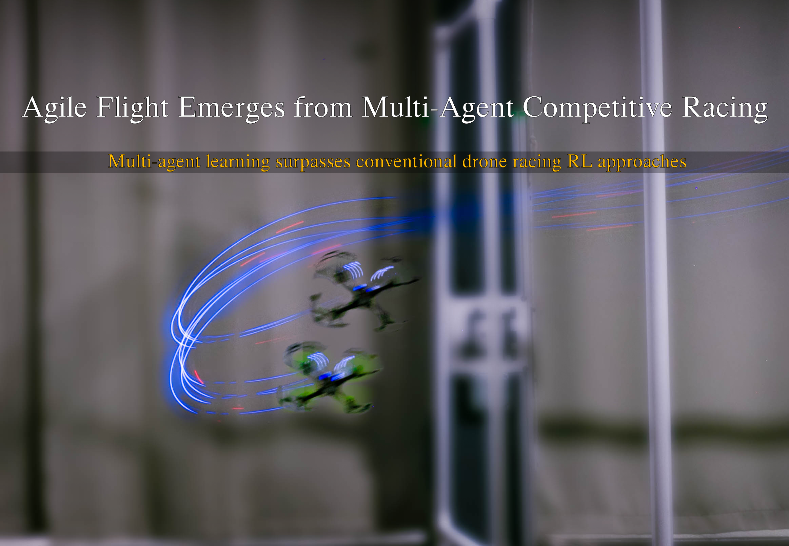

# Agile Flight Emerges from Multi-Agent Competitive Racing

[](https://youtu.be/AIUfCbEJX6E)

This repository contains the code for training and evaluating the single-agent Dense (DS) and Sparse (SS) quadcopter racing policies in our paper, [Agile Flight Emerges from Multi-Agent Competitive Racing](https://arxiv.org/abs/2512.11781).
In order to train Our multi-agent policy, please navigate to the main branch.
## Paper and Video

Paper: [arXiv](https://arxiv.org/abs/2512.11781)

Video: [Youtube](https://youtu.be/AIUfCbEJX6E)

```bibtex
@misc{pasumarti2025agileflightemergesmultiagent,
      title={Agile Flight Emerges from Multi-Agent Competitive Racing}, 
      author={Vineet Pasumarti and Lorenzo Bianchi and Antonio Loquercio},
      year={2025},
      eprint={2512.11781},
      archivePrefix={arXiv},
      primaryClass={cs.RO},
      url={https://arxiv.org/abs/2512.11781}, 
}
```

## Setup

### Prerequisites

- GPU with CUDA support
- NVIDIA Isaac Sim v4.5.0
- NVIDIA Isaac Lab v2.1.0
- Ubuntu 20.04 / 22.04 (recommended)

### Installation

1. Clone the repository:

```bash
# It is critical that the project repo and the Isaac Lab directory are at the same level
git clone https://github.com/Jirl-upenn/AgileFlight_MultiAgent.git
cd AgileFlight_MultiAgent
git checkout AgileFlight_SingleAgent
```

2. Create and activate your Isaac Lab v2.1.0 conda environment ([Isaac Lab installation guide](https://isaac-sim.github.io/IsaacLab/main/source/setup/installation/index.html))

3. Install the package and dependencies:

```bash
# Install the main package
pip install -e .
```

## Training Examples

The main training script uses the [rsl_rl](https://arxiv.org/abs/2509.10771) library.

```bash
# Train Dense Single (DS) policy on the Complex Track
python scripts/rsl_rl/train_race.py \
    --task Isaac-Quadcopter-Race-v0 \
    --num_envs 10240 \
    --max_iterations 10000 \
    --headless \
    --track complex \
    --reward_type dense
```

```bash
# Train Sparse Single (SS) policy on the Lemniscate Track with walls
python scripts/rsl_rl/train_race.py \
    --task Isaac-Quadcopter-Race-v0 \
    --num_envs 10240 \
    --max_iterations 10000 \
    --headless \
    --track lemniscate \
    --use_wall \
    --reward_type sparse
```

## Evaluation

To evaluate a trained policy:

```bash
# Evaluate Our policy on the Complex Track
python scripts/rsl_rl/play_race.py \
    --task Isaac-Quadcopter-Race-v0 \
    --num_envs 1 \
    --track complex \
    --load_run [YYYY-MM-DD_XX-XX-XX] \ # The run directory is in logs/rsl_rl/quadcopter_direct/
    --checkpoint [best_model.pt] \
    --video \
    --video_length 1000 \
    --headless
```